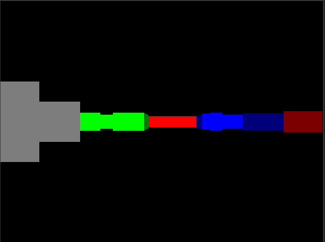
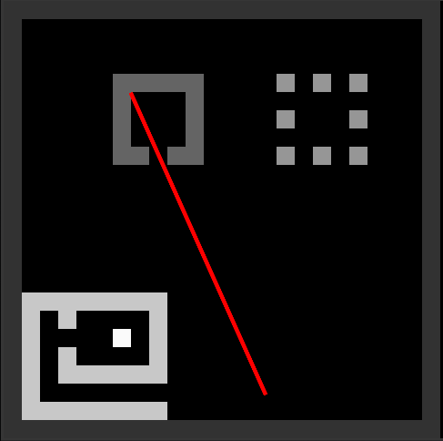

# Project-MFB
A final project whose goal is to remake a simplified version of DOOM using C and GFXlib.

# Table of contents

- [Objectives](#objectives)
- [Main mecanics](#main-mecanics)
- [Controls](#controls)
- [License](#license)

## Preview of actual development :
`First person view :`&emsp;&emsp;&emsp;&emsp;&emsp;&emsp;&emsp;&emsp;&nbsp;&ensp;`Top view :`  
</img>
</img>

# Objectives

 - Setup of the raycasting : Ongoing
 - Setup of the Fake3D : To come
 - Creation of a basic room : To come
 - IA for the NPCs : To come
 - Qualitative textures : To come

# Main mecanics

 - Raycasting
 - Fake3D
 - To come

# Controls

 - Z for moving forward
 - S for moving backward
 - Q and D for the camera
 - To come

# License

ISC License 2023 - URSI. Please have a look at the [LICENSE](LICENSE) for more details.

[(Back to top)](#table-of-contents)
